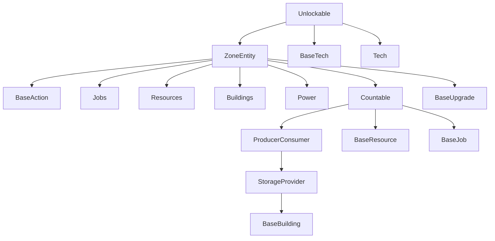

The class heirarchy (but may be stale!):

```mermaid

graph TD;
  Z[Unlockable] --> A[ZoneEntity]
  Z[Unlockable] --> K[BaseTech]
  A[ZoneEntity] --> C[BaseAction]
  E[StorageProvider] --> D[BaseBuilding]
  B[ProducerConsumer] --> E[StorageProvider]
  Z[Unlockable] --> J[Tech]
  A[ZoneEntity] --> X[Jobs]
  A[ZoneEntity] --> L[Resources]
  A[ZoneEntity] --> M[Buildings]
  A[ZoneEntity] --> N[Power]
  A[ZoneEntity] --> Y[Countable]
  A[ZoneEntity] --> F[BaseUpgrade]
  Y[Countable] --> B[ProducerConsumer]
  Y[Countable] --> H[BaseResource]
  Y[Countable] --> I[BaseJob]
```
