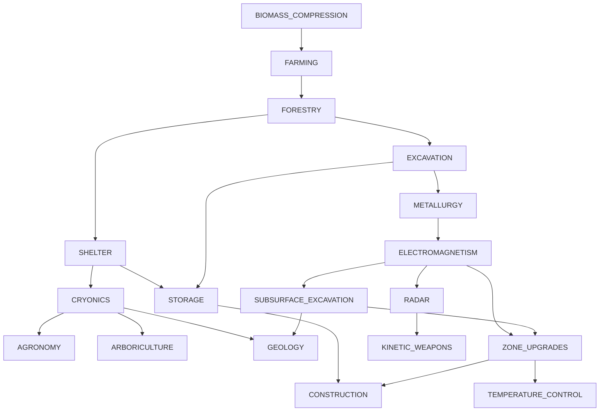

## Autogenerated Tech Tree

This diagram was generated by ./scripts/makeDocs.ts.

```mermaid
flowchart TD;
  BIOMASS_COMPRESSION --> FARMING
  FARMING --> FORESTRY
  SHELTER --> CRYONICS
  SHELTER --> STORAGE
  CRYONICS --> AGRONOMY
  CRYONICS --> ARBORICULTURE
  CRYONICS --> GEOLOGY
  FORESTRY --> SHELTER
  FORESTRY --> EXCAVATION
  STORAGE --> CONSTRUCTION
  EXCAVATION --> METALLURGY
  EXCAVATION --> STORAGE
  METALLURGY --> ELECTROMAGNETISM
  ELECTROMAGNETISM --> ZONE_UPGRADES
  ELECTROMAGNETISM --> SUBSURFACE_EXCAVATION
  ELECTROMAGNETISM --> RADAR
  SUBSURFACE_EXCAVATION --> GEOLOGY
  SUBSURFACE_EXCAVATION --> ZONE_UPGRADES
  ZONE_UPGRADES --> CONSTRUCTION
  ZONE_UPGRADES --> TEMPERATURE_CONTROL
  RADAR --> KINETIC_WEAPONS

```
